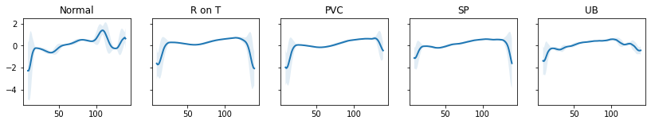

# ECG Anomaly Detection using Deep Learning (LSTM)

This project is an implementation of Time Series Anomaly Detection using LSTM Autoencoders with PyTorch in Python. The project uses real-world Electrocardiogram (ECG) data to detect anomalies in a patient's heartbeat. 

After building an LSTM Autoencoder, it is trained on a set of normal heartbeats, so that it can classify unseen examples as normal or anomalies.

## Steps

- Prepare a dataset for Anomaly Detection from Time Series Data
- Build an LSTM Autoencoder with PyTorch
- Train and evaluate the model
- Select a threshold for anomaly detection
- Classify unseen examples as normal or anomaly

  
## Dependencies
- Python 3.x
- Pandas
- Matplotlib
- Seaborn
- PyTorch
- sci-kit-learn

## Data

The dataset is composed of 5,000 Time Series examples (derived from ECG) which have 140 timesteps. Every sequence is a single heartbeat from an individual afflicted with congestive heart failure, and the data is composed of 5 distinct kinds of heartbeats (classes).
- Normal (N)
- R-on-T Premature Ventricular Contraction (R-on-T PVC)
- Premature Ventricular Contraction (PVC)
- Supra-ventricular Premature or Ectopic Beat (SP or EB)
- Unclassified Beat (UB).

### Average ECG Signal by Class

## Model

The model is composed of an Encoder and a Decoder, the first containing two LSTM layers for compressing the input Time Series data while the latter has two LSTM 
layers as well as an output layer that produces the final reconstruction. The performance is evaluated on the validation set every time we feed the model with all training examples,
and minimize the L1Loss, which is the mean absolute error measure (MAE). 

To turn this into a binary classification task, a certain threshold is selected. The model accurately predicted 142/145 
normal heartbeats from the test set, and the same amount of anomaly examples. Comparing the real and reconstructed Time Series values, we can see how similar they are.

## File Descriptions
- `ECG5000_TRAIN.txt`: The training dataset.
- `ECG5000_TEST.txt`: The testing dataset.

## Acknowledgements
The dataset used in this project is the ECG5000 dataset, which is a publicly available dataset commonly used for benchmarking time series anomaly detection methods.
